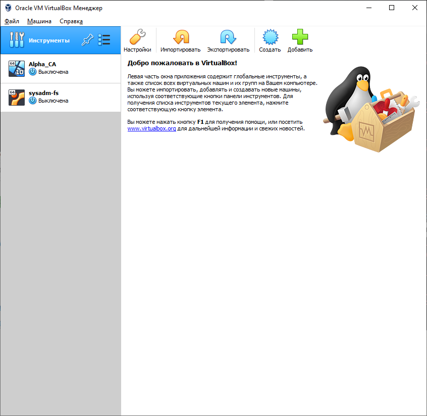

# Домашнее задание к занятию "2. Применение принципов IaaC в работе с виртуальными машинами"

## Задача 1

### Опишите своими словами основные преимущества применения на практике IaaC паттернов.

- Возможность хранении конфигурации серверов инфрастукрутры в виде файлов, позволяет их складывать в сторонние хранилища, делать бэкапы;
- позволяет использовать системы контроля версий, например как git, которые дают такие плюсы как возможность просмотра изменений конфигураций и т.д.;
- автоматизация процесса настройки/развертывания окружения.

### Какой из принципов IaaC является основополагающим?

Идемпотентность — это свойство объекта или операции, при повторном выполнении которой мы получаем результат идентичный предыдущему и всем последующим выполнениям

## Задача 2

### Чем Ansible выгодно отличается от других систем управление конфигурациями?

- не требуется установка дополнительного ПО, в виде агентов, на сервера, которые хотим конфигурировать
- простой синтаксис плейбуков

### Какой, на ваш взгляд, метод работы систем конфигурации более надёжный push или pull?

push, при таком подходе нам не нужно держать какой-то определнный хост как сервер конфигурации, отправка конфигурации может происходить с любого хоста. Так же скорость приминения конфигурации, после внесения изменения запускаем процесс, а не ждем когда хосты заберут и применят изменения самостоятельно.

## Задача 3

### Установить на личный компьютер:

- VirtualBox
- Vagrant
- Terraform
- Ansible

#### VirtualBox



#### Vagrant

```console
PS D:\VM_RDP\Vagrant_learn> vagrant -v
Vagrant 2.3.3
```

#### Terraform

```console
PS D:\VM_RDP\Vagrant_learn> .\terraform.exe -v
Terraform v1.3.9
on windows_amd64
```

#### Ansible

```console
$ ansible --version
ansible 2.8.4
  config file = /etc/ansible/ansible.cfg
  configured module search path = ['/home/Geon/.ansible/plugins/modules', '/usr/share/ansible/plugins/modules']
  ansible python module location = /usr/lib/python3.7/site-packages/ansible
  executable location = /usr/bin/ansible
  python version = 3.7.12 (default, Nov 23 2021, 18:58:07) [GCC 11.2.0]
```

## Задача 4

### Воспроизвести практическую часть лекции самостоятельно.

Немного файлы поменял, т.к. делал на Windows, пришлось использовать Ansible на ВМ. Поменял в provisioner на ansible_local

```console
PS D:\VM_RDP\Vagrant_learn\for_ansible> vagrant destroy
    server1.netology: Are you sure you want to destroy the 'server1.netology' VM? [y/N] y
==> server1.netology: Forcing shutdown of VM...
==> server1.netology: Destroying VM and associated drives...
PS D:\VM_RDP\Vagrant_learn\for_ansible> vagrant up
Bringing machine 'server1.netology' up with 'virtualbox' provider...
==> server1.netology: Importing base box 'bento/ubuntu-20.04'...
==> server1.netology: Matching MAC address for NAT networking...
==> server1.netology: Checking if box 'bento/ubuntu-20.04' version '202206.03.0' is up to date...
==> server1.netology: Setting the name of the VM: server1.netology
==> server1.netology: Clearing any previously set network interfaces...
==> server1.netology: Preparing network interfaces based on configuration...
    server1.netology: Adapter 1: nat
    server1.netology: Adapter 2: hostonly
==> server1.netology: Forwarding ports...
    server1.netology: 22 (guest) => 20011 (host) (adapter 1)
    server1.netology: 22 (guest) => 2222 (host) (adapter 1)
==> server1.netology: Running 'pre-boot' VM customizations...
==> server1.netology: Booting VM...
==> server1.netology: Waiting for machine to boot. This may take a few minutes...
    server1.netology: SSH address: 127.0.0.1:2222
    server1.netology: SSH username: vagrant
    server1.netology: SSH auth method: private key
    server1.netology:
    server1.netology: Vagrant insecure key detected. Vagrant will automatically replace
    server1.netology: this with a newly generated keypair for better security.
    server1.netology:
    server1.netology: Inserting generated public key within guest...
    server1.netology: Removing insecure key from the guest if it's present...
    server1.netology: Key inserted! Disconnecting and reconnecting using new SSH key...
==> server1.netology: Machine booted and ready!
==> server1.netology: Checking for guest additions in VM...
==> server1.netology: Setting hostname...
==> server1.netology: Configuring and enabling network interfaces...
==> server1.netology: Rsyncing folder: /cygdrive/d/VM_RDP/Vagrant_learn/for_ansible/ => /vagrant
==> server1.netology: Running provisioner: ansible_local...
    server1.netology: Installing Ansible...
    server1.netology: Running ansible-playbook...

PLAY [nodes] *******************************************************************

TASK [Gathering Facts] *********************************************************
ok: [server1.netology]

TASK [Create directory for ssh-keys] *******************************************
ok: [server1.netology]

TASK [Adding rsa-key in /root/.ssh/authorized_keys] ****************************
An exception occurred during task execution. To see the full traceback, use -vvv. The error was: If you are using a module and expect the file to exist on the remote, see the remote_src option
fatal: [server1.netology]: FAILED! => {"changed": false, "msg": "Could not find or access '~/.ssh/id_rsa.pub' on the Ansible Controller.\nIf you are using a module and expect the file to exist on the remote, see the remote_src option"}
...ignoring

TASK [Checking DNS] ************************************************************
changed: [server1.netology]

TASK [Installing tools] ********************************************************
ok: [server1.netology] => (item=git)
ok: [server1.netology] => (item=curl)

TASK [Installing docker] *******************************************************
changed: [server1.netology]

TASK [Add the current user to docker group] ************************************
changed: [server1.netology]

PLAY RECAP *********************************************************************
server1.netology           : ok=7    changed=3    unreachable=0    failed=0    skipped=0    rescued=0    ignored=1

PS D:\VM_RDP\Vagrant_learn\for_ansible> vagrant ssh
Welcome to Ubuntu 20.04.4 LTS (GNU/Linux 5.4.0-110-generic x86_64)

 * Documentation:  https://help.ubuntu.com
 * Management:     https://landscape.canonical.com
 * Support:        https://ubuntu.com/advantage

  System information as of Fri 24 Feb 2023 06:06:19 PM UTC

  System load:  0.2                Users logged in:          0
  Usage of /:   15.1% of 30.63GB   IPv4 address for docker0: 172.17.0.1
  Memory usage: 23%                IPv4 address for eth0:    10.0.2.15
  Swap usage:   0%                 IPv4 address for eth1:    192.168.56.11
  Processes:    110


This system is built by the Bento project by Chef Software
More information can be found at https://github.com/chef/bento
vagrant@server1:~$ docker ps
CONTAINER ID   IMAGE     COMMAND   CREATED   STATUS    PORTS     NAMES
```