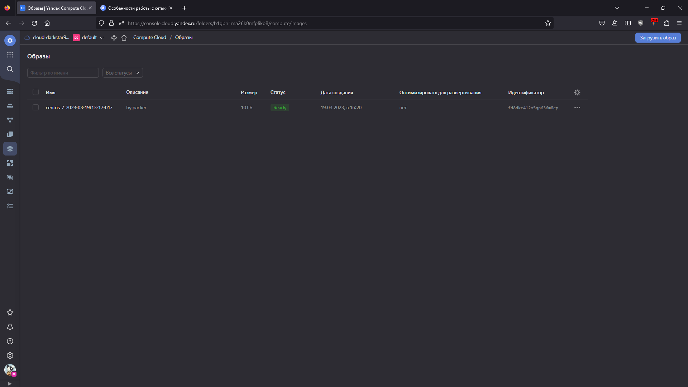
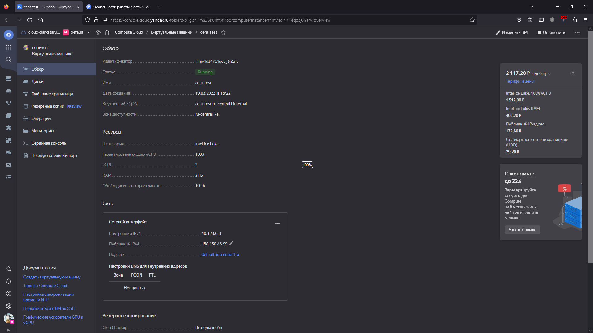

# Домашнее задание к занятию 4. «Оркестрация группой Docker-контейнеров на примере Docker Compose»

## Задача 1

### Создайте собственный образ любой операционной системы



## Задача 2

### Создайте вашу первую виртуальную машину в YandexCloud с помощью web-интерфейса YandexCloud



## Задача 3

### С помощью Ansible и Docker Compose разверните на виртуальной машине из предыдущего задания систему мониторинга на основе Prometheus/Grafana. Используйте Ansible-код в директории

```console
[admin@cent-test ansible]$ sudo docker ps
CONTAINER ID   IMAGE                              COMMAND                  CREATED          STATUS                             PORTS
         NAMES
79cfd7b3c9f2   grafana/grafana:7.4.2              "/run.sh"                31 seconds ago   Up 26 seconds                      3000/tcp
         grafana
185af836ed34   prom/node-exporter:v0.18.1         "/bin/node_exporter …"   31 seconds ago   Up 28 seconds                      9100/tcp
         nodeexporter
76f54973e716   prom/pushgateway:v1.2.0            "/bin/pushgateway"       31 seconds ago   Up 28 seconds                      9091/tcp
         pushgateway
f78d4cc6d18e   gcr.io/cadvisor/cadvisor:v0.47.0   "/usr/bin/cadvisor -…"   31 seconds ago   Up 25 seconds (health: starting)   8080/tcp
         cadvisor
ce1c6e8552ab   prom/alertmanager:v0.20.0          "/bin/alertmanager -…"   31 seconds ago   Up 25 seconds                      9093/tcp
         alertmanager
3a1de54931f4   stefanprodan/caddy                 "/sbin/tini -- caddy…"   31 seconds ago   Up 24 seconds                      0.0.0.0:3000->3000/tcp, 0.0.0.0:9090-9091->9090-9091/tcp, 0.0.0.0:9093->9093/tcp   caddy
3efd55ed4ed4   prom/prometheus:v2.17.1            "/bin/prometheus --c…"   31 seconds ago   Up 28 seconds                      9090/tcp
```

## Задача 4

### Cкриншот работающего веб-интерфейса Grafana с текущими метриками

