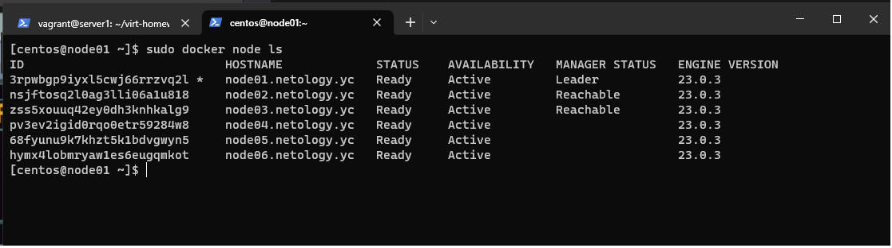
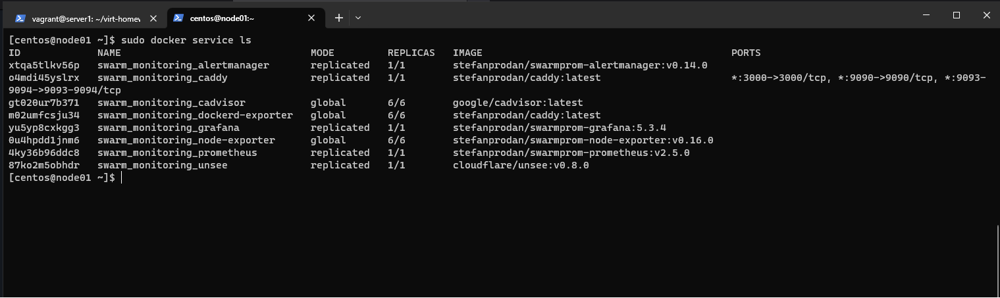

# Домашнее задание к занятию 5. «Оркестрация кластером Docker контейнеров на примере Docker Swarm»

## Задача 1

### В чём отличие режимов работы сервисов в Docker Swarm-кластере: replication и global?

В режиме replicated приложение запускается в том количестве экземпляров, какое укажет пользователь. При этом на отдельной ноде может быть как несколько экземпляров приложения, так и не быть совсем.

В режиме global приложение запускается обязательно на каждой ноде и в единственном экземпляре.

### Какой алгоритм выбора лидера используется в Docker Swarm-кластере?

Для выбора лидера используется алгоритм поддержания распределённого консенсуса - Raft. Протокол решает проблему согласованности: чтобы все manager ноды имели одинаковое представление о состоянии кластера. Если обычный узел долго не получает сообщений от лидера, то он переходит в состояние «кандидат» и посылает другим узлам запрос на голосование. Другие узлы голосуют за того кандидата, от которого они получили первый запрос. Если кандидат получает сообщение от лидера, то он снимает свою кандидатуру и возвращается в обычное состояние. Если кандидат получает большинство голосов, то он становится лидером. Если же он не получил большинства (это случай, когда на кластере возникли сразу несколько кандидатов и голоса разделились), то кандидат ждёт случайное время и инициирует новую процедуру голосования.
Процедура голосования повторяется, пока не будет выбран лидер.

### Что такое Overlay Network?

Является распределенной сетью между несколькими узлами docker. VPN сеть позволяет контейнерам, подключенным к ней (включая контейнеры службы swarm), безопасно обмениваться данными при включенном шифровании. В основе используется технология vxlan.

## Задача 2

### Создайте ваш первый Docker Swarm-кластер в Яндекс Облаке.

## Задача 3

### Создайте ваш первый, готовый к боевой эксплуатации кластер мониторинга, состоящий из стека микросервисов.

