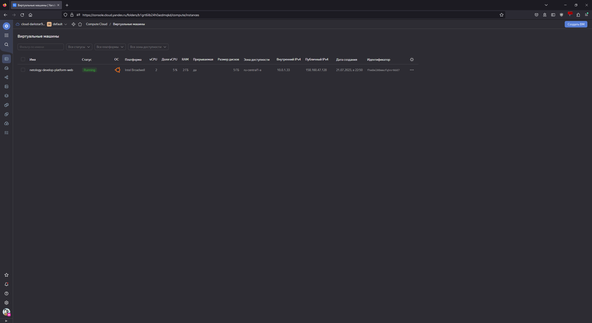
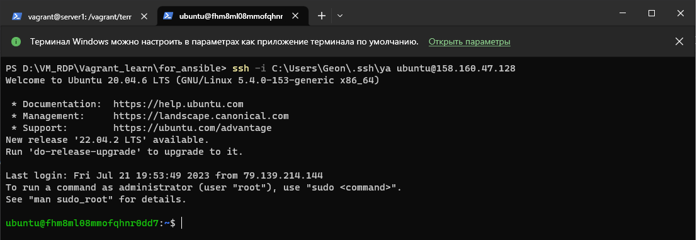

# Домашнее задание к занятию «Основы Terraform. Yandex Cloud»

## Задача 1

<details>
  <summary>Описание задачи</summary>
1. Изучите проект. В файле variables.tf объявлены переменные для yandex provider.
2. Переименуйте файл personal.auto.tfvars_example в personal.auto.tfvars. Заполните переменные (идентификаторы облака, токен доступа). Благодаря .gitignore этот файл не попадет в публичный репозиторий. **Вы можете выбрать иной способ безопасно передать секретные данные в terraform.**
3. Сгенерируйте или используйте свой текущий ssh ключ. Запишите его открытую часть в переменную **vms_ssh_root_key**.
4. Инициализируйте проект, выполните код. Исправьте намеренно допущенные синтаксические ошибки. Ищите внимательно, посимвольно. Ответьте в чем заключается их суть?
5. Ответьте, как в процессе обучения могут пригодиться параметры```preemptible = true``` и ```core_fraction=5``` в параметрах ВМ? Ответ в документации Yandex cloud.

В качестве решения приложите:

- скриншот ЛК Yandex Cloud с созданной ВМ,
- скриншот успешного подключения к консоли ВМ через ssh(к OS ubuntu необходимо подключаться под пользователем ubuntu: "ssh ubuntu@vm_ip_address"),
- ответы на вопросы.

</details>

### Ответ





#### 4. Инициализируйте проект, выполните код. Исправьте намеренно допущенные синтаксические ошибки. Ищите внимательно, посимвольно. Ответьте в чем заключается их суть?

##### первая ошибка

```bash
yandex_compute_instance.platform: Creating...
╷
│ Error: Error while requesting API to create instance: server-request-id = 290e2196-a3e6-4131-91fc-011db79e8306 server-trace-id = 95758d8c351623d8:2ab06f898cae90ae:95758d8c351623d8:1 client-request-id = d49bebfc-8ad0-437a-b6f5-a7882b7620f8 client-trace-id = 8413fb5c-013e-4744-a152-3440507f41ee rpc error: code = FailedPrecondition desc = Platform "standart-v4" not found
│
│   with yandex_compute_instance.platform,
│   on main.tf line 15, in resource "yandex_compute_instance" "platform":
│   15: resource "yandex_compute_instance" "platform" {
│
╵
```

Допущена ошибка в свойстве platform_id, ресурса platform, исправил с "standart-v4" на "standard-v1", согласно доке - <https://cloud.yandex.ru/docs/compute/concepts/vm-platforms> такой платформы нет, взял дефолтную

##### вторая ошибка

```bash
yandex_compute_instance.platform: Creating...
╷
│ Error: Error while requesting API to create instance: server-request-id = 5f25a486-33b9-4b38-86ef-f28994e218c0 server-trace-id = c7b867b6eb20bbd6:7e2a3f24d493ce73:c7b867b6eb20bbd6:1 client-request-id = d2a1a5de-0358-4a32-9725-87edb3a98c6f client-trace-id = d42c493f-f811-4305-ac5d-c7a9eef48d1f rpc error: code = InvalidArgument desc = the specified number of cores is not available on platform "standard-v1"; allowed core number: 2, 4
│
│   with yandex_compute_instance.platform,
│   on main.tf line 15, in resource "yandex_compute_instance" "platform":
│   15: resource "yandex_compute_instance" "platform" {
│
╵
```

Исправил ресурсы согласно требованиям платформы, поменял CPU/RAM на 2/2

#### 5. Ответьте, как в процессе обучения могут пригодиться параметры```preemptible = true``` и ```core_fraction=5``` в параметрах ВМ? Ответ в документации Yandex cloud

preemptible, согласно документации "Прерываемые виртуальные машины — это виртуальные машины, которые могут быть принудительно остановлены в любой момент." Это позволяет меньше тратить денег на ВМ, так же не обязательно помнить о выключении такой ВМ, сама остановится через 24 часа.

core_fraction=5, "Уровни производительности vCPU", минимальная конфигурация для уровня производительности 5%, экономия денег

## Задача 2

<details>
  <summary>Описание задачи</summary>
1. Изучите файлы проекта.
2. Замените все "хардкод" **значения** для ресурсов **yandex_compute_image** и **yandex_compute_instance** на **отдельные** переменные. К названиям переменных ВМ добавьте в начало префикс **vm_web_** .  Пример: **vm_web_name**.
2. Объявите нужные переменные в файле variables.tf, обязательно указывайте тип переменной. Заполните их **default** прежними значениями из main.tf. 
3. Проверьте terraform plan (изменений быть не должно). 

</details>

### Ответ