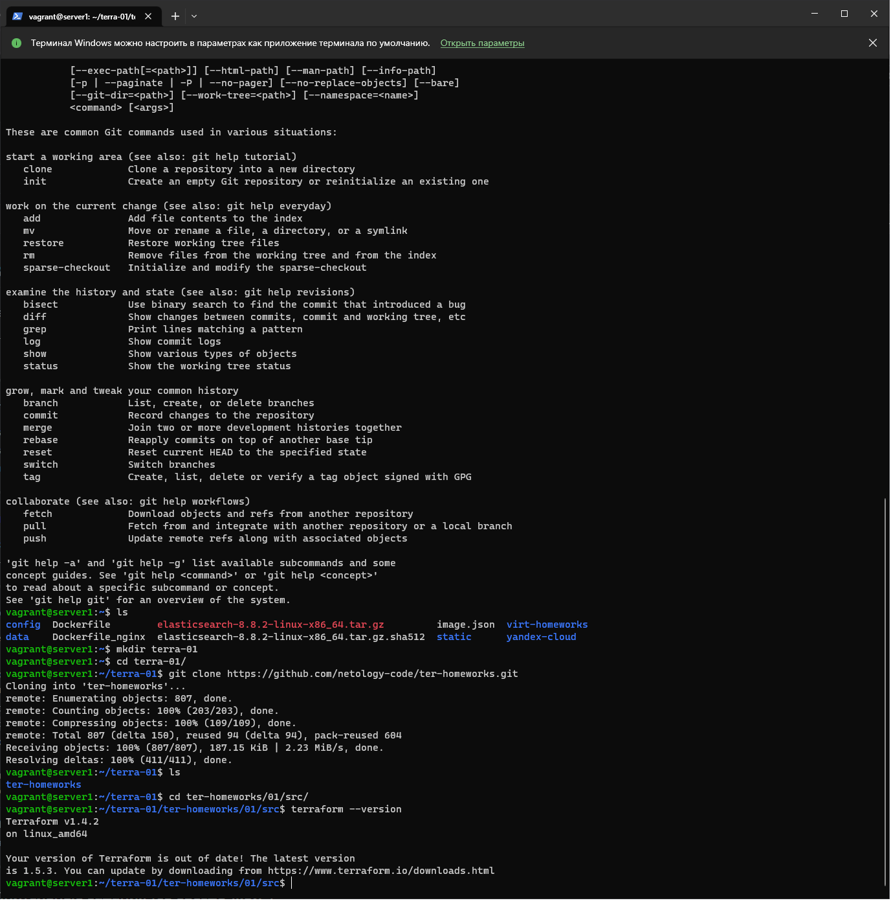

# Домашнее задание к занятию 5. «Elasticsearch»

## Чек-лист

<details>
  <summary>Описание задачи</summary>
### Чеклист готовности к домашнему заданию

1. Скачайте и установите актуальную версию **terraform** >=1.4.X . Приложите скриншот вывода команды ```terraform --version```.
2. Скачайте на свой ПК данный git репозиторий. Исходный код для выполнения задания расположен в директории **01/src**.
3. Убедитесь, что в вашей ОС установлен docker.
</details>

### Ответ

#### 1. Скачайте и установите актуальную версию **terraform** >=1.4.X . Приложите скриншот вывода команды ```terraform --version```.



#### 2. Скачайте на свой ПК данный git репозиторий. Исходный код для выполнения задания расположен в директории **01/src**.

```bash
vagrant@server1:~/terra-01/ter-homeworks/01/src$ ls -all
total 20
drwxrwxr-x 2 vagrant vagrant 4096 Jul 19 19:08 .
drwxrwxr-x 3 vagrant vagrant 4096 Jul 19 19:08 ..
-rw-rw-r-- 1 vagrant vagrant  155 Jul 19 19:08 .gitignore
-rw-rw-r-- 1 vagrant vagrant  756 Jul 19 19:08 main.tf
-rw-rw-r-- 1 vagrant vagrant  206 Jul 19 19:08 .terraformrc
```

#### 3. Убедитесь, что в вашей ОС установлен docker.

```bash
vagrant@server1:~/terra-01/ter-homeworks/01/src$ docker

Usage:  docker [OPTIONS] COMMAND
```

## Задача 1

<details>
  <summary>Описание задачи</summary>
1. Перейдите в каталог [**src**](https://github.com/netology-code/ter-homeworks/tree/main/01/src). Скачайте все необходимые зависимости, использованные в проекте. 
2. Изучите файл **.gitignore**. В каком terraform файле согласно этому .gitignore допустимо сохранить личную, секретную информацию?
3. Выполните код проекта. Найдите  в State-файле секретное содержимое созданного ресурса **random_password**, пришлите в качестве ответа конкретный ключ и его значение.
4. Раскомментируйте блок кода, примерно расположенный на строчках 29-42 файла **main.tf**.
Выполните команду ```terraform validate```. Объясните в чем заключаются намеренно допущенные ошибки? Исправьте их.
5. Выполните код. В качестве ответа приложите вывод команды ```docker ps```
6. Замените имя docker-контейнера в блоке кода на ```hello_world```, выполните команду ```terraform apply -auto-approve```.
Объясните своими словами, в чем может быть опасность применения ключа  ```-auto-approve``` ? В качестве ответа дополнительно приложите вывод команды ```docker ps```
7. Уничтожьте созданные ресурсы с помощью **terraform**. Убедитесь, что все ресурсы удалены. Приложите содержимое файла **terraform.tfstate**. 
8. Объясните, почему при этом не был удален docker образ **nginx:latest** ? Ответ подкрепите выдержкой из документации провайдера.
</details>

### Ответ

#### 2. Изучите файл **.gitignore**. В каком terraform файле согласно этому .gitignore допустимо сохранить личную, секретную информацию?

```
# own secret vars store.
personal.auto.tfvars
```

#### 3. Выполните код проекта. Найдите  в State-файле секретное содержимое созданного ресурса **random_password**, пришлите в качестве ответа конкретный ключ и его значение.

```JSON
          "attributes": {
            "bcrypt_hash": "$2a$10$GbdxleA7dZE/hZtponP52uwlAiCSu7bGyYcTrOXrtjURhDFYSLTjm",
            "id": "none",
            "keepers": null,
            "length": 16,
            "lower": true,
            "min_lower": 1,
            "min_numeric": 1,
            "min_special": 0,
            "min_upper": 1,
            "number": true,
            "numeric": true,
            "override_special": null,
            "result": "kqiC96uw6FfSJhfz",
            "special": false,
            "upper": true
          }
```

#### 4. Раскомментируйте блок кода, примерно расположенный на строчках 29-42 файла **main.tf**. Выполните команду ```terraform validate```. Объясните в чем заключаются намеренно допущенные ошибки? Исправьте их.

```bash
vagrant@server1:~/terra-01/ter-homeworks/01/src$ terraform validate
╷
│ Error: Missing name for resource
│
│   on main.tf line 24, in resource "docker_image":
│   24: resource "docker_image" {
│
│ All resource blocks must have 2 labels (type, name).
╵
╷
│ Error: Invalid resource name
│
│   on main.tf line 29, in resource "docker_container" "1nginx":
│   29: resource "docker_container" "1nginx" {
│
│ A name must start with a letter or underscore and may contain only letters, digits, underscores, and dashes.
```

- у первого ресурса не задано имя, по примеру второго нужно задать имя согласно шаблону (type, name), так:

```
resource "docker_image" "nginx" {
  name         = "nginx:latest"
  keep_locally = true
}
```

- у второго имя нарушает правило валидации из-за того, что начинается с цифры, для исправления достаточно ее убрать

- так же нужно исправить placeholder переменной - "example_${random_password.random_string_FAKE.resulT}", на корректный "${random_password.random_string.result}"

#### 5. Выполните код. В качестве ответа приложите вывод команды ```docker ps```

```bash
vagrant@server1:~/terra-01/ter-homeworks/01/src$ sudo docker ps
CONTAINER ID   IMAGE          COMMAND                  CREATED         STATUS         PORTS                  NAMES
aec36b80e69a   3f8a00f137a0   "/docker-entrypoint.…"   6 seconds ago   Up 5 seconds   0.0.0.0:8000->80/tcp   z3l2VBIdX0xwM6cS
```

#### 6. Замените имя docker-контейнера в блоке кода на ```hello_world```, выполните команду ```terraform apply -auto-approve```. Объясните своими словами, в чем может быть опасность применения ключа  ```-auto-approve``` ? В качестве ответа дополнительно приложите вывод команды ```docker ps```

```bash
vagrant@server1:~/terra-01/ter-homeworks/01/src$ sudo docker ps
CONTAINER ID   IMAGE          COMMAND                  CREATED         STATUS         PORTS                  NAMES
1c2499f25b57   3f8a00f137a0   "/docker-entrypoint.…"   6 seconds ago   Up 5 seconds   0.0.0.0:8000->80/tcp   hello_world
```

Опасность приминения ключа заключается в том, что мы не проводим double check изменений, которые хотим применить и возможно приминение деструктивных изменений для инфрастурктуры. Без ключа можно ознакомиться с планом и проверить, все ли корректно.

#### 7. Уничтожьте созданные ресурсы с помощью **terraform**. Убедитесь, что все ресурсы удалены. Приложите содержимое файла **terraform.tfstate**. 

```bash
vagrant@server1:~/terra-01/ter-homeworks/01/src$ cat terraform.tfstate
{
  "version": 4,
  "terraform_version": "1.4.2",
  "serial": 20,
  "lineage": "22f5086b-0727-b21e-c808-7c92ab9cc37a",
  "outputs": {},
  "resources": [],
  "check_results": null
}
```

#### 8. Объясните, почему при этом не был удален docker образ **nginx:latest** ? Ответ подкрепите выдержкой из документации провайдера.

Из-за заданного параметра keep_locally = true, выдержка из документации:
keep_locally (Boolean) If true, then the Docker image won't be deleted on destroy operation. If this is false, it will delete the image from the docker local storage on destroy operation.